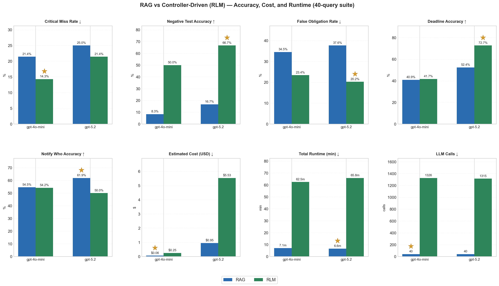

# Controller-Driven Retrieval Benchmark

**A controlled experiment comparing two evidence consumption strategies for regulatory compliance extraction: single-pass RAG vs. iterative Controller-Driven search with verification.**

---

## Results Summary (January 2026)

### Results Visualization



*★ indicates best result for each metric. ↑ = higher is better, ↓ = lower is better.*

### Model Comparison (40 queries)

| Metric | gpt-4o-mini |  | gpt-5.2 (SOTA) |  |
|--------|-------------|---|----------------|---|
|        | RAG | RLM | RAG | RLM |
| **Critical Miss Rate** ↓ | 21.4% | **14.3%** | 25.0% | **21.4%** |
| **Negative Test Accuracy** ↑ | 8.3% | **50.0%** | 16.7% | **66.7%** |
| **False Obligation Rate** ↓ | 34.5% | **23.4%** | 37.6% | **20.2%** |
| **Deadline Accuracy** ↑ | 40.9% | 41.7% | 52.4% | **72.7%** |
| Notify Who Accuracy | 54.5% | 54.2% | **61.9%** | 50.0% |

### Cost (40 queries)

| Model | RAG | RLM | Total |
|-------|-----|-----|-------|
| gpt-4o-mini | $0.10 | $0.24 | **$0.34** |
| gpt-5.2 | $1.08 | $5.13 | **$6.21** |

### Key Findings

1. **Architecture still matters at SOTA (precision)**: Controller-Driven (RLM) is much better at suppressing false positives on negatives (66.7% vs 16.7% negative test accuracy with GPT-5.2) and lowers the false obligation rate (20.2% vs 37.6%).

2. **More capable model ≠ higher recall here**: In this benchmark, GPT-5.2 increased critical miss rate for both strategies (RAG: 21.4% → 25.0%, RLM: 14.3% → 21.4%), suggesting it is more conservative about what counts as an obligation.

3. **Verification is a precision/recall trade-off**: RLM’s verifier rejected a larger share of extracted candidates with GPT-5.2 (72% vs 56% with gpt-4o-mini). That helps precision, but can also drop legitimate-but-weakly-evidenced obligations.

4. **Repair loop shines when the obligation is found**: With GPT-5.2, RLM achieved the best deadline accuracy (72.7%), but this is conditional on the obligation being correctly located first.

5. **Trade-off guidance (given this 40-query test set)**:
   - Minimize cost: RAG + gpt-4o-mini ($0.10 / 40 queries)
   - Minimize false positives: RLM + GPT-5.2 (best negative accuracy + lowest false obligation rate), at much higher cost
   - Best deadline-field extraction: RLM + GPT-5.2 (72.7% deadline accuracy), also at much higher cost

*Caveat: Results are from a 40-query gold standard; treat them as directional rather than definitive.*

Run `python run_all_experiments.py` to run **both** strategies on the full 40-query suite and write a timestamped comparison report to `eval/results/comparison_report_*.txt` (plus per-run JSON + logs).

---

## TL;DR

| | RAG | Controller-Driven |
|---|-----|-------------------|
| **Approach** | Retrieve top-k chunks → 1 LLM call | Discover → search → extract → verify → repair |
| **Config name** | `rag` | `rlm` |
| **Cost** | Lower | Higher |

```bash
pip install -r requirements.txt
python run_all_experiments.py
# → Results in eval/results/comparison_report_*.txt
```

---

## What This Is

A reproducible A/B comparison isolating **one variable**: evidence consumption strategy.

- **Single-pass RAG:** Retrieve top-k chunks, format as context, one LLM extraction call.
- **Controller-Driven (RLM-inspired):** Iteratively discover docs → search within each doc → extract per paragraph → verify → repair. Code config name: `rlm`.

**Not included:** The original RLM paper’s REPL-based setup where the LLM writes Python to decide retrieval (see [Reference](#reference)). This repo uses a deterministic controller for reproducibility.

---

## Two Strategies

### RAG (Single-Pass)

Retrieve top-k chunks → format context → one LLM call.

- Hybrid semantic + BM25 retrieval (top-6 after reranking)
- One LLM call extracts all obligations
- No post-processing
- Fast, low cost

### Controller-Driven (Iterative)

Discover docs → search within each → extract per paragraph → verify → repair.

- BM25 discovery of relevant documents (max 2 per state)
- BM25 search within each doc with query expansion (max 10 paragraphs per state)
- LLM extraction per paragraph (all obligations, not just first)
- Verification: drop obligations that don't match query intent
- Repair: fill missing fields only if substring matches source text
- Slower, higher cost

See [SYSTEM_ARCHITECTURE.md](SYSTEM_ARCHITECTURE.md) for implementation details.

---

## Reproducibility

Both strategies use identical:

| Control | Value |
|---------|-------|
| LLM model | `gpt-4o-mini` default (configurable via `--model`) |
| Temperature | `0` (deterministic, locked) |
| Extraction prompt | Hash-verified at runtime |
| Output schema | Same Pydantic models |
| Corpus | 17 regulatory documents |
| Scoring | Same evaluator logic |
| Output limit | Top 3 obligations (ranked by completeness) |

The **only variable** is evidence consumption strategy.

See [EXPERIMENT_GUIDE.md](EXPERIMENT_GUIDE.md#why-the-comparison-is-fair) for detailed fairness rationale.

---

## Demo

```bash
# Install
pip install -r requirements.txt

# Set API key
$env:OPENAI_API_KEY = "sk-..."  # PowerShell
# export OPENAI_API_KEY="sk-..."  # Bash

# Run both strategies on 40 test queries
python run_all_experiments.py

# With different model
python run_all_experiments.py --model gpt-5.2

# Verbose output (shows per-span extraction details)
python -m eval.run_eval --experiment rlm --verbose
```

**One-off debugging:**
```bash
python run_rag.py "incident reporting" NJ
python run_rlm.py "incident reporting" NJ
```

---

## Interpreting Results

The comparison report shows metrics side-by-side:

| Metric | What it measures |
|--------|------------------|
| **Critical Miss Rate** | % of positive cases where gold obligation not found (lower = better) |
| **Negative Test Accuracy** | % of negative cases with no false positives (higher = better) |
| **False Obligation Rate** | % of returned obligations that are incorrect (lower = better) |
| **Deadline/Notify Accuracy** | Field extraction quality (only for matched obligations) |
| **Cost** | Tokens and USD |

**Controller-Driven wins if:** Lower miss rate AND lower false positive rate at acceptable cost.

---

## Federal Baseline Policy

State queries (e.g., "NJ incident reporting") return **both state AND federal** obligations. Federal rules (NERC CIP, DOE) apply to all utilities. Federal obligations are not false positives for state queries.

See [EXPERIMENT_GUIDE.md](EXPERIMENT_GUIDE.md#federal-baseline-policy) for scoring details.

---

## Limitations

1. **Fixed budgets:** 2 docs, 10 paragraphs per state may not generalize
2. **Paragraph boundaries:** Can miss obligations split across paragraphs
3. **Corpus size:** 17 documents, regulatory domain only
4. **Verification trade-off:** Filters out obligations with unsupported fields (precision over recall)

---

## Repository Structure

```
├── rag/                    # RAG retriever implementation
├── rlm/                    # Controller-Driven loop (config: rlm)
├── eval/                   # Harness, prompts, gold standard (40 queries)
├── corpus/normalized/      # 17 documents + indexes
├── run_all_experiments.py  # Main entry point
└── requirements.txt
```

---

## Documentation

- **[EXPERIMENT_GUIDE.md](EXPERIMENT_GUIDE.md)** — Running experiments, metrics, scoring
- **[SYSTEM_ARCHITECTURE.md](SYSTEM_ARCHITECTURE.md)** — Technical implementation details

---

## Reference

This repository is **RLM-inspired** (iterative evidence consumption with tool use), but uses a deterministic controller for reproducibility.

- Alex L. Zhang, Tim Kraska, Omar Khattab. “Recursive Language Models.” arXiv:2512.24601 (2025). https://doi.org/10.48550/arXiv.2512.24601

---

**License:** MIT
